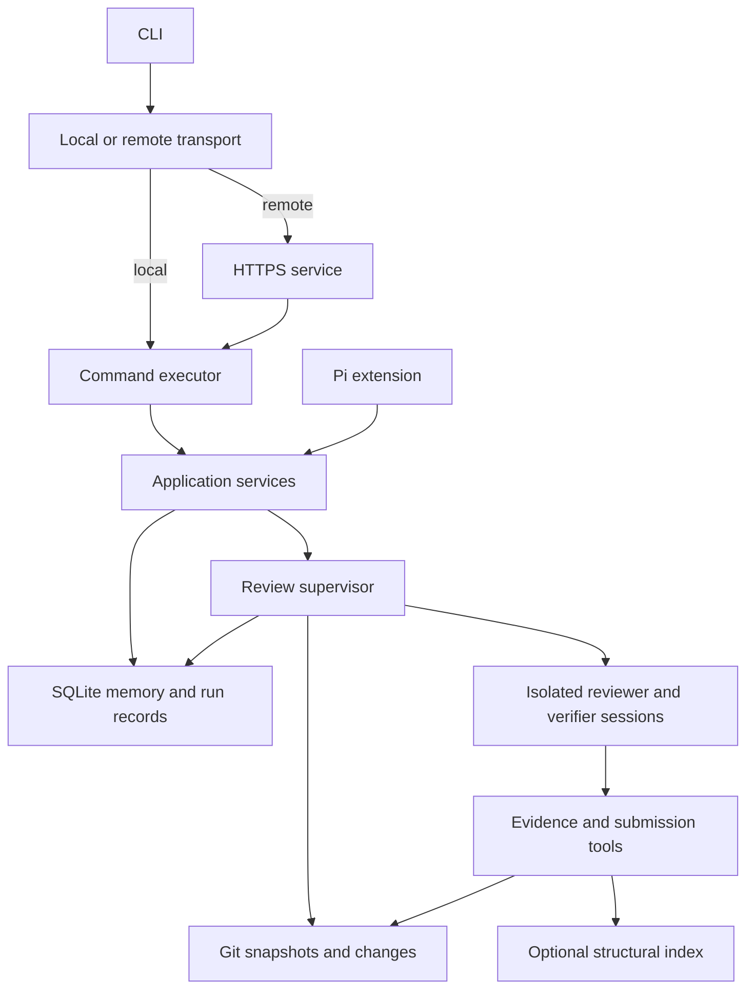

# How pir is built

pir combines git snapshots, read-only Pi sessions, and repository memory to
produce structured review results. This document describes the implementation
in this checkout. [The review-loop guide](review-loop.md) explains how evidence
becomes a finding; [the agent guide](for-llm.md) covers operating the CLI.

## Entry points and shared code

The CLI chooses local or remote execution before dispatching a command. The
HTTPS service invokes the same command executor on the server. Pi extension
commands call the application services directly, sharing the review engine
and memory operations without going through the CLI parser.



The main boundaries are:

| Directory | Responsibility |
| --- | --- |
| `src/cli` | argument parsing, transport configuration, remote requests, job pickup |
| `src/app` | contexts, commands, result rendering, repository materialization |
| `src/core` | discovery scheduling, verification draining, budgets, audit coverage |
| `src/changes` | immutable revisions, diffs, working-tree snapshots, tree inventory |
| `src/agents` | Pi session isolation, prompts, usage, transcripts |
| `src/tools` | pinned evidence tools and structured collectors |
| `src/findings` | finding identity, statuses, deduplication |
| `src/memory` | SQLite repositories, feedback, bootstrap, refresh, synchronization |
| `src/plugins` | built-in language guidance and activation |
| `src/server` | HTTPS execution, jobs, read-only web access, live observation |
| `src/observability` | run events and manifests |
| `src/extension` | Pi commands and their lifecycle |
| `web` | the React run explorer, built into `dist/web` |

## Two review targets

A change review and an audit ask different questions. They share sessions,
candidate identity, verification, budgets, and memory rules, but have different
discovery schedulers in `src/core/supervisor.ts`.

### Change reviews

`buildChangeSet` resolves the requested base and head to commits, finds their
merge base, and builds the diff from **merge base to head**. This distinction
matters when reviewing a branch against another branch: the requested base
can differ from the old side of the diff.

`find` defaults to the selected head's parent and head. `--uncommitted` creates
a synthetic commit from the working tree, including staged, unstaged, and
untracked content, using a temporary index. The user's index and branches are
preserved. For a review limited to uncommitted work, an explicit `--base HEAD`
also makes the intended comparison consistent across local and remote runs.

### Audits

`buildRepoSnapshot` inventories the committed tree with git, recording blob
IDs, file modes, sizes, scope selection, and content classification. Its
inventory is the audit coverage denominator. Neither the working filesystem
nor the structural index decides which files belong to the snapshot.

`--path` selects literal files or directory prefixes; repeated paths form a
union. `--skip` adds exclusions using `*`, `**`, and `?`, or literal prefixes.
Default exclusions cover dependency directories, build output, lockfiles,
minified files, and pir state. Selected non-reviewable entries such as
symlinks, submodules, binary extensions, and files over 1,000,000 bytes are
marked blocked.

The planner groups files by module, using exact snapshot line counts. The
current planner allows up to five owned ranges and 1,200 lines per unit;
files over 800 lines are divided into 500-line chunks. These are scheduling
limits, not separate model token budgets. One run-wide budget, finding limit,
and deduplication state span every unit.

`pir audit --dry-run` (#56) runs the same snapshot and planner and reports
head/tree ids, per-selection and per-classification counts, and the planned
unit count without creating a run or invoking a model. `pir audit coverage
(--run <id>|--latest)` reads the per-file ledger a run persisted through
`upsertProgress`. `--max-findings unlimited` (#57) removes the report cap:
result envelopes and run manifests carry `maxFindings: null` plus an explicit
`maxFindingsMode` of `capped`/`unlimited`, and every supervisor budget check
passes through a null cap while token/round budgets still bound the run.

## Evidence and session isolation

Evidence tools resolve `head`, `base`, and `merge-base` to the pinned commits.
`read_code`, `search_text`, and `get_change` return bounded pages with
provenance and continuation information. Audit sessions replace diff access
with `list_snapshot_files`; they have no comparison revision.

Built-in `read`, `grep`, `find`, and `ls` tools, and optional codegraph queries,
help navigation. They may describe the checkout or index rather than the
selected commit. A snapshot claim therefore needs confirmation through pinned
tools. Candidate anchors are validated against the selected head. An entirely
deleted file in a change review can instead use its merge-base location,
recorded with an explicit old-side evidence note.

`PiSessionFactory` creates a fresh in-memory session for each reviewer round
and each candidate verification. Its explicit resource loader loads no
ambient AGENTS files, SYSTEM files, skills, extensions, prompt templates, or
hooks. Settings are assembled in memory and the built-in tool allowlist
contains only read operations. The SDK model runtime still reads authorized
model credentials and selected model/thinking preferences.

Repository content, tool output, and retrieved memory enter these sessions as
untrusted evidence. Installed pir language packs are a separate source of
review guidance. Agents have structured submission tools but no source-edit,
shell-execution, or decision-memory-write tools.

## Findings and durable state

The reviewer submits candidates through `record_candidate` and finishes with
`finish_round`. Each verifier submits one `submit_verdict`. Plain assistant
text is not parsed into either a candidate or a verdict.

The supervisor keeps three collections: known candidates for deduplication,
pending candidates for verification, and verified results. Only `confirmed`
and `uncertain` results consume the reporting limit. A result can also retain
`rejected`, `expected`, `false_positive`, `accepted_risk`, or `wont_fix` status.

Change reviews persist findings and remaining candidates when the run ends,
including the handled reviewer-failure path. Audits checkpoint candidates
after discovery sessions, update the same rows after verification, and persist
unit/file coverage transitions during execution. This makes progress visible
during long audits. Reading stored candidates does not resume them in a later
run.

A run is persisted as `completed`, `incomplete`, or `failed`. Pending
verification, verification execution errors, unfinished discovery, or unfinished
audit coverage prevent a clean completion. The public result also includes
the stop reason and measured/estimated usage.

## Repository memory

The memory facade opens a SQLite database in WAL mode and exposes five
knowledge layers, alongside run records and finding evidence:

| Layer | Stores | Typical writer |
| --- | --- | --- |
| Project | responsibilities, conventions, invariants, risk areas | bootstrap or explicit user knowledge |
| Feature | feature scope and behavior | bootstrap/refresh or user knowledge |
| Code entity | symbol contracts, notes, freshness metadata | bootstrap/refresh or user knowledge |
| Issue decision | claim, trigger, decision, scope, rationale, provenance | user feedback |
| Finding resolution | original trigger and post-fix state | user feedback, then fix verification |

The reviewer receives a bounded memory pack of project, feature, entity, and
verified-fix context. Historical issue decisions and their rationales remain
verifier-only. Bootstrap and refresh are explicit model-backed operations;
starting a review does not automatically summarize the repository.

A matching suppressive decision takes effect only when it has a trusted source
(`user_explicit` or `verified_fix`) and the verifier explicitly marks that
decision's `stillApplies` as true. Agent summaries cannot grant suppression.
The original decision stays recorded when current code no longer fits it.

`feedback fixed` records a claimed fix with `verified: false`. `verify-fix`
checks the original trigger at committed HEAD, upgrades a verified resolution,
or reopens a finding when the trigger still exists. `remember` stores explicit
project, feature, or symbol knowledge. These user operations append feedback
events for auditability.

### Identity and storage paths

Project identity is computed from repository history and origin:

```text
projectId = sha256((normalizedRemote ?? "local") + "\0" + rootCommit)
```

Branches and checkout paths are absent from the key. Different clones share
memory identity when their normalized remote and root commit match.

For ordinary local opens, database resolution is:

1. Explicit application `dbPath`
2. `PIR_MEMORY_DB`
3. `<repo>/.pir/memory.sqlite` when `PIR_STATE_IN_PROJECT=1`
4. `PIR_STATE_ROOT/<projectId>/memory.sqlite`
5. Platform state directory: Linux uses `$XDG_STATE_HOME/pir/<projectId>` or
   `~/.local/state/pir/<projectId>`; macOS uses Application Support and Windows
   uses AppData.

Bundle and registered-repository service flows pass an explicit central
database path, so state survives deletion of the temporary worktree.

`memory sync` exports knowledge and version metadata, merges with the server,
and applies the merged snapshot locally. Both stores converge; user/verified
knowledge outranks agent summaries and newer versions resolve conflicts within
the same authority level. Logical feature, entity, and decision records are
reconciled across replicas. Findings, review runs, audit coverage, transcripts,
and feedback-event logs are not synchronized.

## Remote execution

Client configuration selects a transport, not a different engine. Repo-context
commands normally use `/v1/review`:

1. The client resolves refs and identifies the repository.
2. It creates a git bundle in a throwaway temporary bare repository whose
   `objects/info/alternates` points at the checkout's object store (resolved
   via `git rev-parse --git-common-dir`, so linked worktrees work): the
   source repo is never written, a read-only `.git` is sufficient, and
   concurrent invocations cannot collide (#46). Thin bundle first for change
   reviews when a base is available; other repo commands send full history.
   `find --uncommitted` is the one local-write exception — it records
   working-tree objects in the source repo before packing.
3. The service imports the bundle and creates a detached temporary worktree.
4. The shared executor runs against that worktree and the central database.
5. The worktree is cleaned up; the result and durable state remain.

A missing thin-bundle prerequisite causes the client to resend full history.
The server verifies the requested head exists in the shipped repository. Named
refs are pinned to SHAs before execution. Bundles carry unpushed history and
synthetic working-tree commits, so the service needs no origin credentials.

Registered repositories are an alternative: `repos add` creates a server-side
clone and `--repo <name>` materializes a worktree from it. These commands use
`/v1/exec`; fetching a private registered origin requires server credentials.

### Queueing, reads, and jobs

The serve process serializes mutating executor work, including bundle
materialization, execution, and cleanup. Proven read-only commands can run
outside that queue with a bounded concurrency limit. SQLite reads use a
read-only WAL connection and avoid migrations and index synchronization.

Remote `findings list` and `findings show` first send only repository identity
to `/v1/review`. They read an existing database without uploading a bundle or
waiting for the review queue. On first contact or an old database schema, the
client resends a bundle through the normal path.

Every queued `/v1/review` request has a job. With `async: true`, the service
responds with HTTP 202 and a job ID; clients poll `/v1/jobs/<id>` for the
result. A synchronous client's disconnect also leaves the job running and its
result available. Bundled remote audits use asynchronous submission by default.
`--detach` makes any find/audit submission asynchronous and returns right
after acceptance (#53): stdout carries a submission envelope with the full
job id; exit 0 attests acceptance, never review success. Wait paths render a
poll-liveness line on state changes and about once a minute (#55) —
connection alive and log growth, explicitly not review progress.

Jobs are process-local delivery records. They keep 2,000 recent log lines,
cap retained output at 32 MiB, and retain the latest 100 settled jobs. A restart
loses the registry and interrupts running work; it does not erase checkpointed
SQLite records. A job status of `completed` means command delivery completed;
its result code can still be nonzero.

Because that registry is volatile, every accepted async submission also writes
a client-side receipt under `~/.pir/receipts/` (0600, following
`PIR_CONFIG_DIR`): origin, job id, the locally computed project identity, the
pinned base/head, and the credential-free argv. Once the job settles, the run
id is copied from the result envelope's `data.run.id` — authoritative, never
guessed from the head. `pir receipts list/show` read them and print the exact
recovery commands; `pir jobs` surfaces them when an id no longer resolves.

Run-scoped recovery commands (`pir runs status`, `pir findings
list|show|export --run <url>`) talk to the server's read-only web tier
directly, keyed on the `<origin>/runs/<projectId>/<runId>` URL the web UI and
the receipts hand out. They perform no local git work, so they function from
any directory on an unconfigured machine. `findings export` walks all finding
pages and details with bounded concurrency and per-item retries, writes via a
temp file plus rename, and checkpoints completed findings next to the output
so an interrupted run resumes; a live run exports a snapshot marked
`complete: false`.

### Authentication and TLS

`PIR_SERVER_TOKEN` or `serve --token` protects execution, synchronization, and
job endpoints with bearer authentication. `/health` is public. TLS comes from
an explicit certificate/key pair or an automatically generated self-signed
pair. If generation is unavailable, plain HTTP requires `PIR_ALLOW_HTTP=1`.

The client's remote response wait (#54) resolves once per invocation —
`--remote-timeout` > `PIR_REMOTE_TIMEOUT` > `server.timeoutSeconds` > 1800s,
`0` disabling — and is normalized into the environment so the review, jobs
and web-tier paths share one dispatcher.

The web tier's viewer credential is deliberately separate from the execution
token: `--viewer-token` > `PIR_VIEWER_TOKEN` > `server.viewerToken`, with no
fallback in either direction. Env and config viewer tokens are bound to the
configured server origin and are never sent to a foreign origin a run URL
might name — only the explicit flag travels.

Client `server.url` and token settings are independent of model credentials.
A remote client can omit its local model configuration entirely. The client's
`model` config and `PIR_MODEL` are not forwarded; an explicit `--model` is.
Host services use Pi settings/auth on the service machine. Container-only
`PI_AUTH_JSON`, `PI_API_KEY__<provider>`, and `PI_DEFAULT_*` are translated by
the Docker entrypoint into that same Pi configuration.

## Observation and the web explorer

The supervisor emits run and session events into a process-local event bus.
The serve live registry exposes those events to the browser through SSE.
Observation does not invoke review commands or change their scheduling.

With `PIR_TRANSCRIPTS=1`, settled SDK session snapshots are stored beside the
memory database in `transcripts/<runId>/`, together with a `run.json` manifest.
Snapshots include retained messages, tool calls/results, effective session
metadata, and usage. They are not raw provider requests; compaction can replace
earlier messages and thinking appears only when the provider/SDK supplies it.

The optional web explorer uses `PIR_WEB_UI_TOKEN`, separate from executor
authentication. It is read-only and uses SQLite WAL readers. Without a viewer
token it opens only on a loopback bind. Enabling it sets `PIR_TRANSCRIPTS=1`
only if that variable is unset. Compose passes an empty value by default,
so recording there requires an explicit `PIR_TRANSCRIPTS=1`.
Runs executing in the same serve process stream live; local CLI or extension
runs appear as historical records when their state is accessible to the server.

## Structural context and language packs

The codegraph adapter is optional. An installed and initialized index provides
symbol, caller, callee, and reference queries. If it cannot be used, pir exposes
`degraded: true` and continues with pinned file/diff tools. It does not
automatically run `codegraph init` on a user's checkout; index synchronization
is best effort and can be skipped with `--no-sync-index`. Every run logs the
codemap decision to stderr once — `codegraph active (N nodes, …)` or
`codegraph degraded (<reason>)`.

Serve mode needs one more step (#64): reviews execute in throwaway worktrees,
and codegraph fixes its index at `<path>/.codegraph` with no external-index
option, so an index in the project dir is invisible to the review by
construction. `PIR_CODEGRAPH=1` (opt-in) makes materialization seed an index in
the persistent project dir (registered clone or bundle cache), copy it into the
fresh worktree, sync it to the reviewed head, and copy the database back so the
next review syncs incrementally. Activation is best effort — on any failure the
worktree index is stripped and the review runs degraded rather than blocked or
served from a suspect index. Without the opt-in, serve reviews stay degraded
even when the CLI is installed in the image.

One known cost: activation runs inside the server's single serial request
queue, so the first review of a project (full index build, minutes on large
repos) head-of-line blocks unrelated queued reviews, and re-seeding after a
dropped seed repeats it. That is the documented tradeoff of the opt-in; a
per-project queue lane would remove it if serve ever grows one.

Built-in `golang` and `typescript` packs activate from marker files at the
selected head, or from `--plugins`. Both currently provide separate reviewer
and verifier guidance for change and audit modes. A pack without audit variants
can be detected for an audit but its change guidance is withheld.

## Related decisions

- [Shared review machinery for change and audit targets](adr/0001-shared-review-executor.md)
- [Web payloads for long runs](adr/0002-web-ui-long-run-payloads.md)

The ADRs record decisions at the time they were made. Current module behavior
is described above and in the source files.
