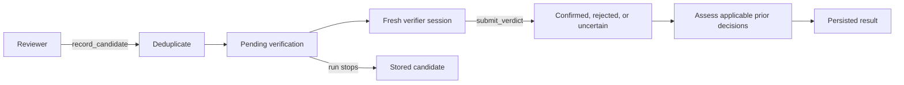

# From evidence to findings

A pir run is a sequence of independent reviewer and verifier sessions. The
supervisor decides what to investigate next, keeps pending work, enforces
limits, and records results. Sessions provide evidence and structured
submissions; they do not own the run's durable state.

This guide describes the current loop in
[`src/core/supervisor.ts`](../src/core/supervisor.ts). For storage and transport
boundaries, see [the design guide](design.md).

## The question sets the evidence requirement

| Command | Target | What the verifier must establish |
| --- | --- | --- |
| `find` | diff from the resolved merge base to head | a real problem introduced or unmasked by the change |
| `audit` | one committed snapshot | a real problem that exists at that snapshot |

Change review requires attribution. A suspicious path already present on both
sides needs evidence that the change made it fail or exposed it. Audit has no
comparison side: an old defect is still in scope when it exists in the selected
commit.

Both modes look for a concrete causal chain: a reachable trigger, the code
responsible for the behavior, and an incorrect outcome. Guards, callers,
contracts, tests, and alternative paths can disprove a proposed finding. The
verifier revisits that chain independently rather than adopting the reviewer's
assertion.

## Reading the reviewed code

`read_code` and `search_text` read immutable git revisions. Change sessions can
select `head`, the requested `base`, or `merge-base`, which is the actual old
side of the diff. Audit evidence uses `head` only. Tool output carries commit
provenance and pagination information.

`get_change` pages files, hunks, and raw hunk lines, including removed code.
For deleted or renamed files, old-side reads use the explicit old path. Audit
reviewers use `list_snapshot_files` to navigate the pinned tree.

Built-in filesystem reads and codegraph queries are navigation aids. They can
reflect a different revision, so pinned reads are needed to support a claim
about the target. A truncated page or a search with no matches cannot prove
that a guard or caller is absent.

The model sessions are read-only. They inspect test source as evidence but
cannot execute tests or edit code.

## Candidate lifecycle



The reviewer calls `record_candidate` for each supported hypothesis. The
collector validates its category, severity, evidence, and snapshot anchors,
then builds a stable fingerprint from claim, trigger, category, and
feature/entity scope. Line numbers are not part of the fingerprint.

Anchors normally refer to head; a file entirely deleted by a change can use
its merge-base location with an explicit evidence note.

Within a run, exact fingerprints and sufficiently similar claims in matching
entity/category scope are deduplicated. Fresh candidates enter a queue ordered
by severity. This queue, the deduplication baseline, and verified results are
separate.

A reviewer session must call `finish_round` to submit its summary, further
focus, completion signal, and optional coverage, unresolved questions, and
blockers. Missing that call makes the session fail. Candidates already
submitted through tools can still be recovered and persisted on the handled
failure path.

Each candidate is checked in a fresh verifier session. `submit_verdict` yields
`confirmed`, `rejected`, or `uncertain`, with rationale and confidence. Missing
verdicts become `uncertain` with `missing-verdict`; provider/session failures
become `uncertain` with `provider-error`. Those execution failures increment
`verificationErrors`.

Tools execute sequentially. The terminal submission (`finish_round` or
`submit_verdict`) must be the only tool call in its assistant turn, after
evidence gathering and other collector calls have finished.

`confirmed` and `uncertain` consume the finding limit. Rejected and
decision-suppressed results do not. Pending candidates are returned separately
as `pendingFindings` and counted by `pendingCandidates`.

## Change-review scheduling

A change review defaults to two loop rounds, at most eight verifications per
round, and ten reported findings. These are ceilings; a review can finish with
fewer findings or none. There is no default token ceiling.

At the start of a round, existing pending work takes priority. A discovery
session runs only when the queue is empty and the reviewer has requested more
investigation. After discovery, the supervisor verifies as many queued
candidates as the limits allow. A later round can contain only verification.

`--max-rounds` counts both discovery and verification-only rounds. The loop
ends when discovery is complete and the queue is empty, a budget or report
limit is reached, or two consecutive rounds produce no new information. An
empty discovery result can continue if the reviewer requests another pass and
the limits allow it.

Later discovery sessions receive bounded summaries and code-only verification
feedback. Historical issue decisions stay verifier-only. Feedback from a
verifier is withheld when it received or queried issue history, preventing
decision rationale from being passed back into discovery.

Change-review rows are written on run completion or the handled failure path.
Stored pending candidates can be inspected with:

```bash
pir findings list --status candidate --json
```

This is inspection, not automatic queue resumption. A new invocation starts a
new review run.

## Audit scheduling and coverage

Audits enumerate the committed git tree, apply scope/exclusion rules, and
partition reviewable text into deterministic work units. Each unit owns files
or line ranges. Reviewers may follow dependencies elsewhere in the snapshot,
but those context reads do not expand the unit's coverage obligation.

The same pending queue and verification drain are shared across units.
Verification drains before another discovery session is scheduled. Global
deduplication, `--max-findings`, and the optional token budget span the whole
audit. Audit rejects `--base`, `--uncommitted`, `--branch`, and `--max-rounds`.

Each unit gets up to two discovery attempts by default. The prompt asks the
reviewer to read its owned ranges; the current completion check verifies that
every owned **file path** had a successful pinned head read in that session.
It does not measure exhaustive reading of every line. A completion claim
without those reads causes a retry, then a blocked unit if the obligation
remains unmet. A request for another pass is retried within the attempt limit.

Audit candidates are checkpointed after discovery sessions, before their
verification. Verdicts update the same durable rows. File and unit transitions
are also stored as the run progresses, so stored findings and coverage can be
examined before a long audit ends. There is no automatic restart/resume of an
interrupted audit.

Coverage records the work that was completed:

| File state | Meaning |
| --- | --- |
| `reviewed` | all owning units completed their allotted review |
| `partial` | some owning units completed |
| `unreviewed` | no owning unit completed |
| `blocked` | selected content or an owning unit could not be reviewed |
| `failed` | an owning unit failed |
| `excluded` | default policy or `--skip` excluded the file |
| `notSelected` | the file is outside `--path` selection |

`reviewed` is a process claim, not proof of defect-free code. Binary-extension,
symlink, submodule, and oversized entries in scope stay visible as blocked.
Stopping at a finding or token limit leaves the remaining scope accounted for.

`coverage.units` and summary counters are returned in JSON; per-file records
are stored in SQLite. `suspectedDuplicates` is advisory: similar reports across
units are flagged for inspection without automatically suppressing a possibly
independent defect.

## Historical decisions and fix memory

Reviewer memory packs contain project, feature, entity, and verified-fix
context. They omit historical issue decisions. Bootstrap and refresh are
explicit operations that create or update summaries; reviews do not run them
automatically.

Before verification, the supervisor matches issue history by fingerprint,
scope, claim, category, and supporting paths. The verifier receives decision
IDs, triggers, provenance, rationales, and stale markers. It assesses each
eligible ID separately with `stillApplies`; an unassessed ID does not suppress
a finding. A legacy single boolean is accepted only for a single matched ID.

Suppression requires both trusted provenance (`user_explicit` or
`verified_fix`) and explicit applicability. Supported suppressive decisions
are `expected`, `false_positive`, `accepted_risk`, and `wont_fix`. A verifier
can confirm a technical defect while also confirming that the user previously
accepted that same risk. The stored result then retains the applicable
decision status.

Code or contract changes can make the old decision inapplicable. Staleness
prompts revalidation rather than automatically invalidating a decision, and
the absence of a stale flag does not establish freshness.

Marking a finding `fixed` records an unverified resolution. `verify-fix` checks
committed HEAD against the original trigger. A successful check records a
verified fix; a reproducing trigger reopens the finding. Inspect
`verifiedFixed`, `triggerStillReproduces`, and `rationale` in its result.

## Limits, incompleteness, and exit codes

Token budgets are checked between sessions. An in-flight session may exceed
the remaining budget; pir does not cancel that model turn at the limit.
`--max-tokens` and other numeric limits must be positive integers.

`data.incomplete` covers pending candidates, verification execution errors,
unfinished change discovery, and incomplete audit coverage. Audit additionally
returns `incompleteReasons`. A persisted run uses status `incomplete` when
those conditions remain.

For `find` and `audit`, exit behavior is:

| Condition | Exit code |
| --- | --- |
| `--fail-on none` and a result was produced | `0`, even when incomplete |
| a `confirmed` or `uncertain` finding meets the configured threshold | `1` |
| no qualifying finding, but a gated review is incomplete | `3` |
| no qualifying finding and the gated review completed | `0` |
| invalid usage | `2` |
| execution fails before producing a result | `3` |

Automation should check both the process code and the result diagnostics.

## Session metrics and transcripts

`usage` reports SDK-accounted input, output, cache-read, and cache-write tokens,
total tokens, cost, session durations, tool calls, and repeated read/search
calls. Output tokens already include billed reasoning. `usageComplete` is true
only when every charged session supplied usage. Missing usage remains missing;
it is not a measured zero.

`estimatedTokens` is the budget counter: measured tokens when supplied,
otherwise an estimate from available text. `durationMs` measures the review
run; summed session durations measure session work. `uncertaintyReasons`
separates `missing-evidence`, `tool-limit`, `provider-error`, and
`missing-verdict` outcomes.

With `PIR_TRANSCRIPTS=1`, retained SDK messages and effective session metadata
are written beside the database. These snapshots are useful for investigation,
but are not provider request captures. Thinking depends on provider/SDK output,
and compaction may replace earlier context.

## Evaluating changes to the loop

The model-free suite covers tool validation, scheduling, session isolation,
persistence, and output rules. [Live evaluation](../tests/eval/README.md) uses
committed labeled scenarios and is opt-in with `PIR_EVAL=1`.

Paired comparisons use the same fixtures and independently copied seed memory.
Scoring matches findings one-to-one by claim, location, category, and severity;
extra reports and duplicates count against precision, and uncertain matches
do not count as confirmed successes. Recall and precision need to be read
alongside usage completeness, cost, elapsed time, verification errors, and
pending work. Deterministic test results alone do not establish model quality.
